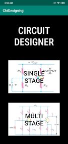

# CircuitDesigner
This is an android project, which is used to design a transistor-resistor-capacitor.
It can be used to design single-stage and multi-stage amplifier circuits.

## Platform used
Android Studio

## Language used
- XML
- Java

The project is still a work in progress, only 1 section is done yet.
Soon to get updated with second phase.
